# Facility Breach - Unreal Engine Project

Unreal Engine C++ project.

## Key Features

- Player abilities system
- Items and inventory system
- Interactable objects and doors
- Objective system
- Tutorial system
- Checkpoints system
- Enemy AI
- UI and Slate

### Player abilities system

The player abilities system allows the player to have multiple abilities. Abilities are defined in a DataTable where each row has its own:
- `name`
- `icon`
- `cooldown time`
- `max charges`
- `input key`
- `sound`

The actor component `UAbilityComponent`, attached to the character, is responsible for keeping track of abilities' statuses (like cooldown time or available charges) allowing them to be triggered by player input.

At the moment, there are two abilities: dash and scan.

#### Dash

A simple dash in the direction of movement (or forward if not moving).

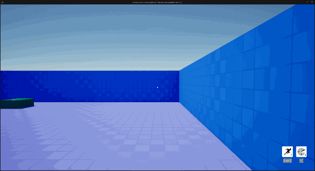

#### Scan

A spherical scan with its center on player's position, that reveals enemies behind walls using post-process materials.


## Items and inventory system

Items can be picked up by the player and added to the inventory. Pressing the `TAB` input key can show the inventory.

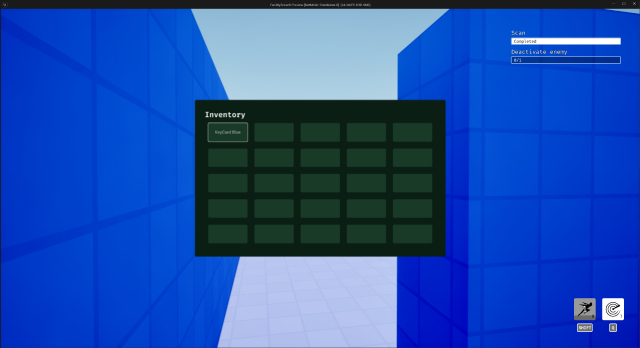

Items are defined in a DataTable where each row has its own `id` and `name`.

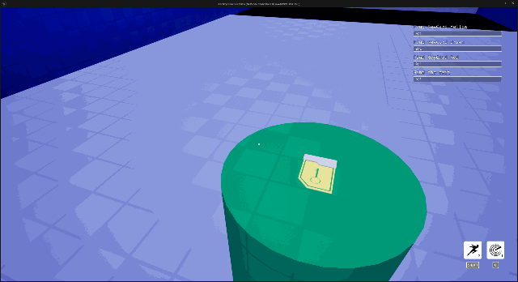

## Interactable objects and doors

Actors using the `UInteractableInterface` interface are meant to be interactable. Each actor can decide what to do when focused or interacted with.

Usually, a white outline appears around the actor mesh when focused, using post-process materials. Interaction depends on the type of actor. For example, an item can be picked up on interaction, meanwhile a door opens.

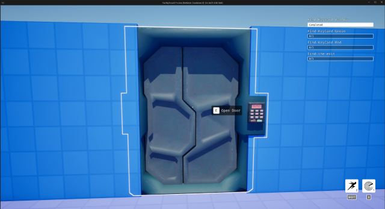

Also, doors may require a specific item in the player's inventory to be interacted with. `ADoor` actor performs these checks within the `OnInteract()` function.

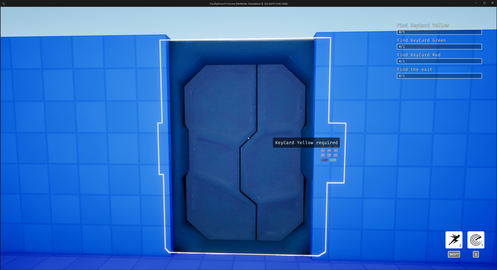

## Objective system

The objective (sub)system receives events from gameplay and keeps track of the current player's objective and updates the UI accordingly. Each objective may have multiple goals like `Pick up a card` or `Open a door`. Each goal may have requirements that must be met to be considered completed.

A requirement is usually composed of:
- `actor`: the actor triggering the event
- `action`: the action triggered

Thanks to `actor` and `action` it is possible to filter events. The objective system is responsible for checking if the event satisfies an active goal's requirements or not, and also responsible for checking if the current objective is completed.

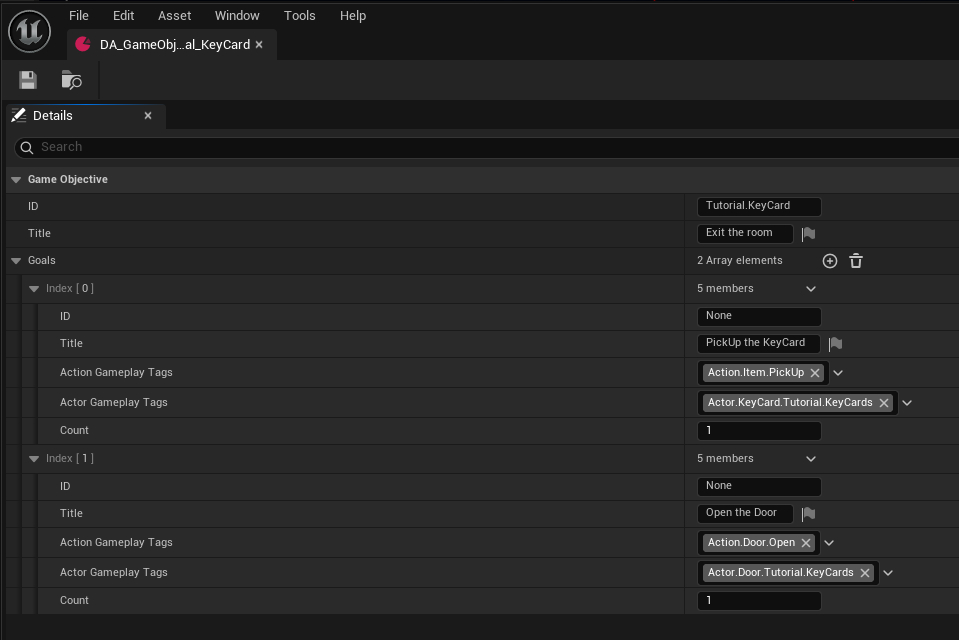

`actor` and `action` are both Unreal Engine built-in `GameplayTags` defined in multiple DataTables. `actor` tags are assigned to actors in the level, meanwhile `action` tags are selected in the code. Below, an example of `ADoor` emitting an "open" action.

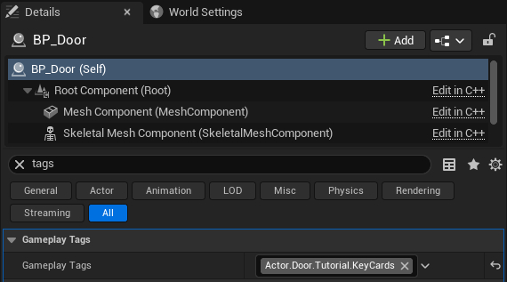

```
void Open()
{
    GameObjectivesSubsystem->Emit(this, GameObjectivesSubsystem->Tag_Action_DoorOpen);
}
```

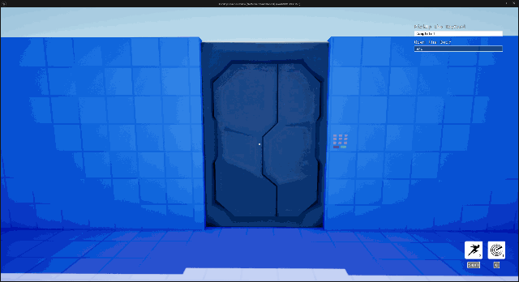

## Tutorial system

The tutorial (sub)system is responsible for showing a popup with instructions. These instructions are DataAssets.

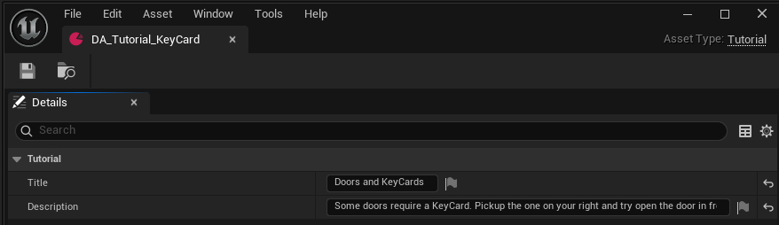

## Checkpoints system

Checkpoints are simple boxes that react on player overlapping. It is possible to customize the triggers of each checkpoint in the level editor. Checkpoints can:
- act as respawn checkpoint
- trigger a tutorial popup
- trigger a new objective
- push an event to the objective system

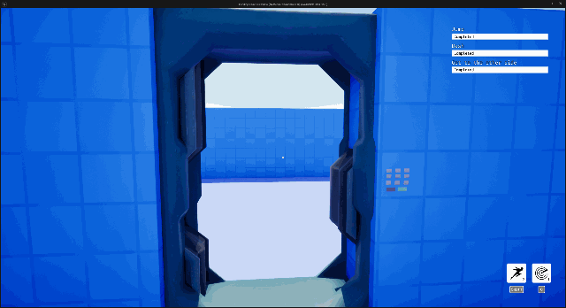

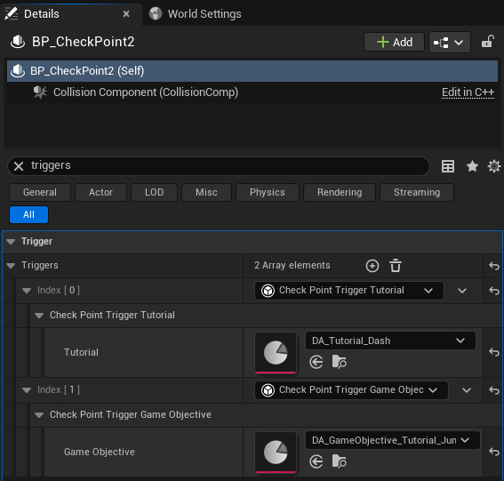

## Enemy AI

Enemies follow a path made by waypoints. A waypoint is an actor that can be placed in the level editor and can change how enemies behave when they are on the waypoint:
- time the enemy stays on the waypoint
- facing direction

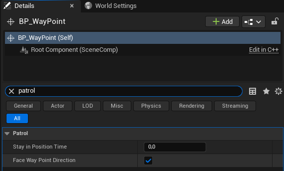

Waypoints can be referenced in enemies in patrol settings. If an enemy has no waypoints, it will not move. Other than waypoints, settings like speed or vision range can be adjusted in patrol settings.

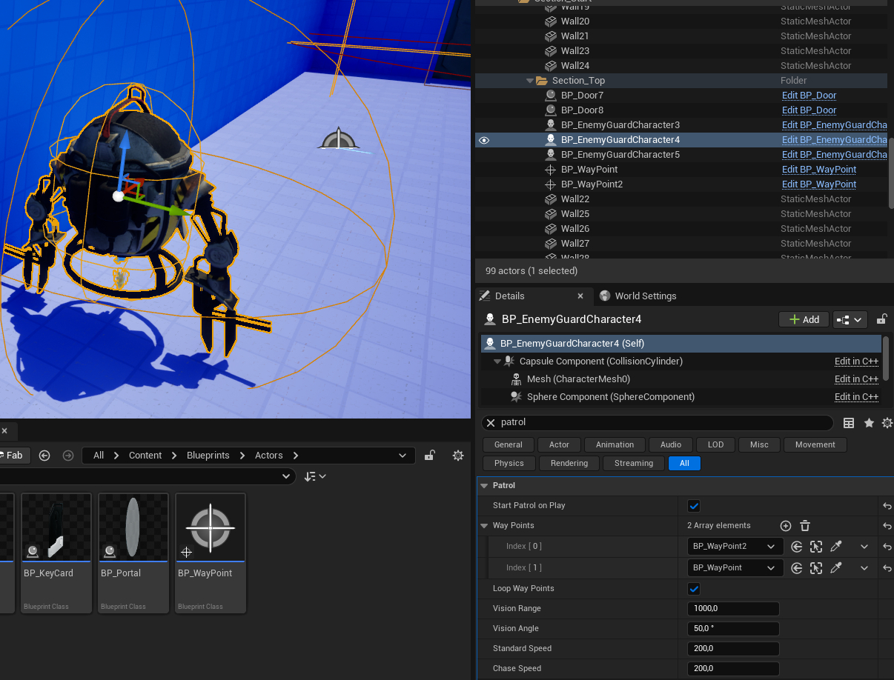

When an enemy detects the player in its vision range, it starts the chase. The AI status (idle, patrol, alert, chase) is controlled by a custom AI controller.

When an enemy touches the player, the game ends.

## UI and Slate

All the UI is being made in Slate.